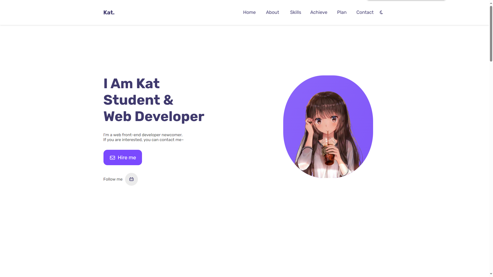
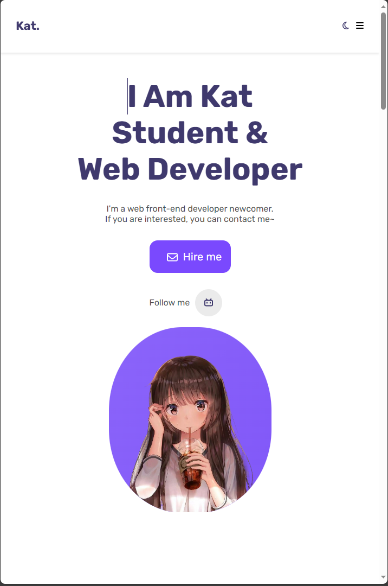
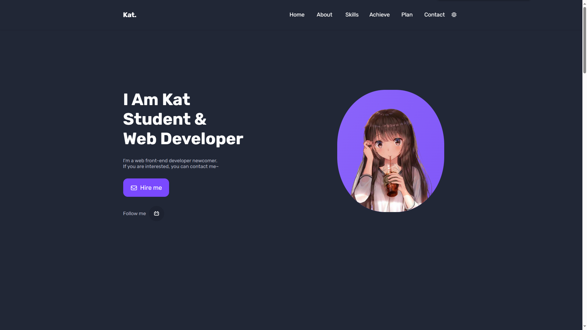

# 个人主页页面

一个精美的个人主页，用于展示个人信息，方便他人浏览

## 页面展示







## 项目启动

### 开发

先将项目克隆到本地

```sh
#安装项目依赖
npm install
```

```sh
#以开发模式运行
npm run dev
```

### 部署

```sh
#安装项目依赖
npm install
```

```sh
#打包项目
npm run build
```

## 简介

项目使用了 `Vue.js`、`less` 作为技术栈，基于`vite`开发

## 项目特点

-   UI 美观

    对 UI 进行精美的设计，是页面风格统一，提高用户的满意度和使用体验。清晰、直观的界面、吸引人的颜色和排版，以及易于导航的布局都使得用户更好地使用网站。

-   动画流畅

    使用 `gsap` 来设计出流畅的过渡、悬停、点击等动画，增强用户对网站的互动感知。使用户操作更自然，提高用户满意度。

-   响应式布局

    使用媒体查询检测设备宽度并自动做出调整，适配大部分的屏幕尺寸，
    使网站在不同设备上都能良好地展示，提高用户体验。

-   深色模式

    设计出浅色主题和深色主题两种方案供用户选择，满足大部分用户的需求。
